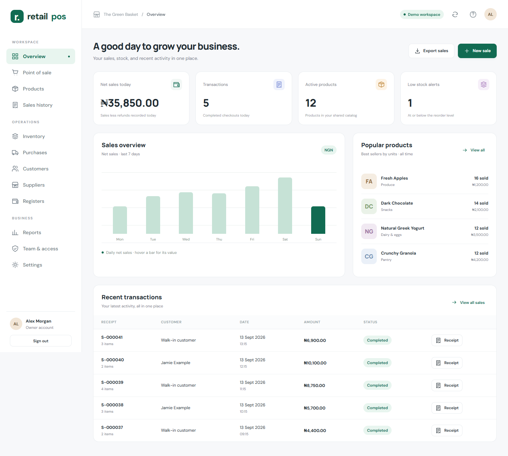
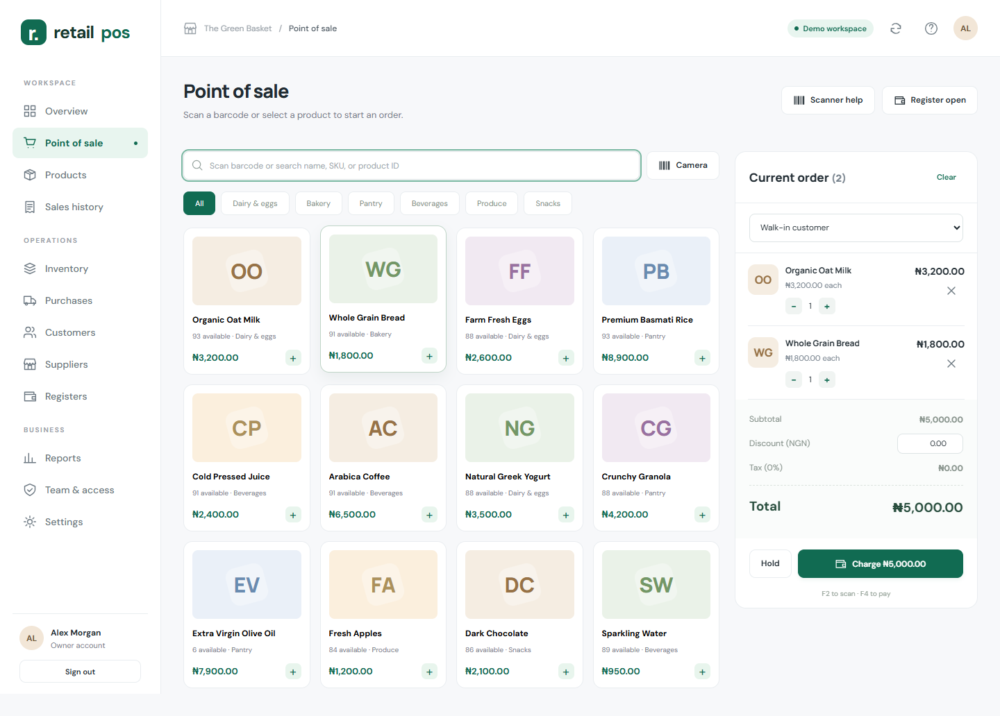
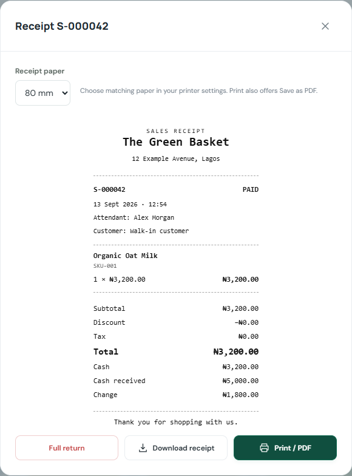
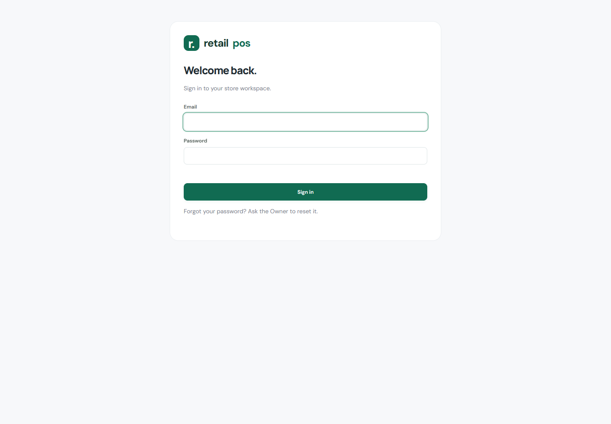

# Retail POS

A custom retail workspace built with Google Apps Script and Google Sheets, designed around clear navigation, fast checkout, and straightforward stock management for one company and one store.

**Status: version 0.5 — password sign-in validation release.** Core workflows are implemented and tested locally. Live Google authorization, staff sign-in, device compatibility, and workload acceptance checks remain before production rollout.

## A view of the workspace

The screenshots below use fictional products, customers, and transactions from the local demo. They contain no live business data.

## What is implemented

- Product catalog with categories, SKUs, barcodes, and reorder levels.
- One stock balance per product, supplier receiving, and adjustments.
- Checkout with discounts, tax, recorded cash/card/transfer or split payments, and printable receipts.
- USB/Bluetooth keyboard-scanner input and Code 128 product label generation.
- Password sign-in, temporary-password changes, session expiry, account lockouts, and Owner-managed user roles.
- Continuous scan/search focus, product ID and name entry, and stored receipt details.
- 58/80 mm receipt layouts, downloadable HTML receipts, and browser Print / Save as PDF.
- Full returns, register opening/closing, and cash reconciliation.
- Customers, suppliers, date-filtered reports, and CSV exports.
- Owner, account manager, and sales rep permissions, with a focused sales-rep interface and protected prices.
- Responsive desktop, tablet, and phone layouts, including a mobile order shortcut.

Camera scanning is optional and browser-dependent. Card and bank-transfer transactions are recorded after external confirmation; this release does not charge a payment gateway. Staff now use Owner-created email/password accounts. Password hashes and session records stay in a private Users sheet. Live Google acceptance testing remains required.

## Validation so far

- 32 business-rule and simulated Google-adapter tests passed.
- 10 browser tests passed, including barcode checkout, returns, stock adjustments, label rendering, onboarding, response-loss retries, and responsive layout checks.
- Desktop and mobile screenshots reviewed using fictional demo data.

These checks do not replace live Google, scanner, printer, permission, or load testing.

## Next milestones

- Complete live business setup and confirm persistent Google Sheets transactions.
- Validate staff password sign-in and role permissions on the hosted app.
- Test actual barcode readers and receipt/label printers.
- Measure realistic checkout traffic and validate backup/recovery procedures.
- Expand capabilities based on pilot feedback, including payment integrations and additional retail workflows.

Offline checkout, native installation, partial returns, loyalty, supplier payables, and expiry/serial tracking are not part of this release.

## About this repository

This repository presents curated development progress and sanitized UI previews. Application source is maintained privately. Credentials, operational identifiers, private implementation files, and real customer records are excluded.

Built by [virtue2004](https://github.com/virtue2004).
